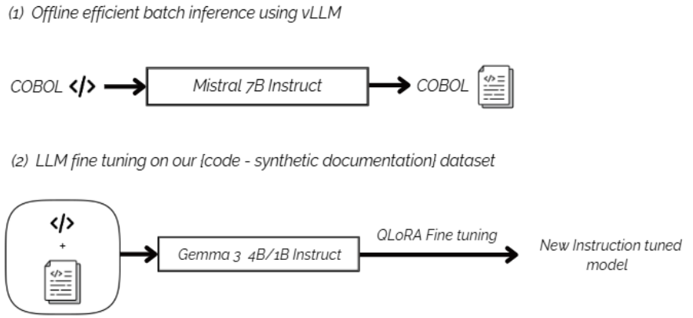
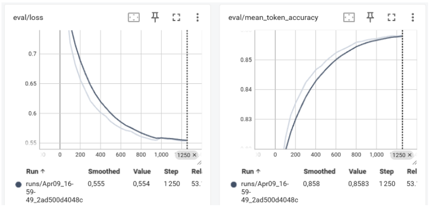

# Documentation Generation for COBOL Code Using Optimized Language Models

## Description

This project explores the use of small, optimized language models to automatically generate documentation from COBOL code. **En particulier, nous optons pour la spécialisation de petits modèles de langage pour COBOL, ce qui permet d'obtenir des performances optimales tout en restant léger et accessible.** Although COBOL is an older language, it remains a cornerstone in legacy systems, especially in the banking sector. However, accompanying documentation is often scarce or missing. This notebook offers a lightweight and effective solution to bridge that gap, designed for resource-constrained environments where these systems are still in operation.

## Context and Motivation

Developed in the 1950s, COBOL is still used in many critical systems, particularly in banking. The scarcity of data and documentation for this language complicates maintenance and modernization efforts. This project aims to leverage compact language models to generate precise descriptions of COBOL code, offering an accessible and cost-effective approach in terms of computational resources.

## Objectives

- Efficient batch inference with vLLM to generate synthetic documentations from COBOL code.
- Develop a lightweight solution compatible with resource-limited environments.
- Evaluate the quality of the generated documentation compared to real examples.

## Prerequisites

To run this notebook, you will need the following:
- **A100 40GB GPU** 
- **Python**: Version 3.7 or higher.
- **Python Libraries**:
  - `transformers`
  - `datasets`
  - `torch`
- **Data**: A JSON file (`data.json`) containing COBOL code/documentation pairs. This dataset is semi-synthetic, blending real-world examples with synthetically generated data to address the scarcity of COBOL documentation and enhance model training.
- **Environment**: Jupyter Notebook or a compatible IDE (e.g., VS Code with the Jupyter extension).

### Semi-Synthetic Dataset Creation

Due to the limited availability of COBOL code-documentation pairs, a semi-synthetic dataset was developed:
- **Real Data**: Sourced from existing COBOL.
- **Synthetic Data**: Efficient batch inference using vLLM.
- **Purpose**: This approach expands the dataset’s size and variety, enabling the model to better generalize across diverse COBOL structures while remaining applicable to real-world use cases.

This semi-synthetic dataset is a cornerstone of the project, overcoming the challenge of data scarcity and ensuring robust model performance.

## Methodology

The project follows a structured pipeline to process COBOL code and generate documentation. The workflow is illustrated below:

- **Data Preprocessing**: Cleaning and formatting the semi-synthetic dataset.
- **Model Specialization**: Fine-tuning small language models specifically for COBOL.
- **Documentation Generation**: Using the specialized model to generate descriptive documentation.
- **Evaluation**: Comparing generated documentation against real examples.

## Results

The performance of the specialized models is evaluated using various metrics, and the results are visualized in the following curves:

These curves demonstrate the model's ability to generate accurate documentation while maintaining efficiency in resource-constrained environments.
